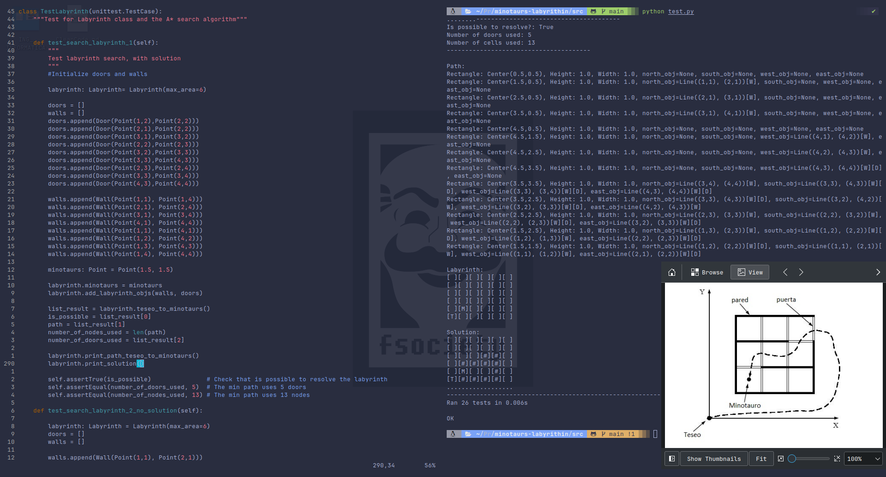

# A* search algorithm in minotaurs labyrinth
A project for solve minimal path between Teseo and Minotaurs.
- The Laberinth is a 2 dimensional square that is composse of empty cells of 1u^2 unit, each cell is a square with 4 edges and 4 cell neighbours(except the edge cells of the map)
- Each cell can have in the edge a Wall(dosent allow to pass to the adjacent cell) or a Door(let pass to the adjacent cell) or Nothing between the cells.
- The minimal path is defined as the path that uses the less number of doors and less number of cell to reach the minotaurs from the position of Teseo
- Teseo and the Minotaur will be considered points in a cell

## Structure
Project is divided in set of tools for 2 dimension manage, a node, a graph of nodes representing the labyrinth and the `algorithm of search A*`. 

Module **two_dimension** in `src/labyrinth/two_dimension.py` is a set of simple tools for creating a mange two dimesnional planes:
    
    * Class **Point**
    * Class **FiniteLine**, represents a finite line with 2 points as edge and a finite length.
    * Class **Rectangle** , defined by the 4 edge points or 4 edege lines.
    
Each class has the necessary tools for representing two dimesional finite plane and do simple operations. 

Module **labyrinth_objects** in `src/labyrinth/labyrinth_objects.py` contains the objects that could be in the labyrinth
    
    * Class **Wall**
    * Class **Door**
    
Walls and Doors objects are represented as a finite line in a two dimension and later will be parsed by the labyrinth to be added into corresponding cells  
 
Module **graphs** in `src/labyrinth/graphs.py` contains the objects for the representation of the graph
    
    * Class **CellNode** represents a cell in the labyrinth
    * Class **GridCellNode** represents a cell and its neighbours in the labyrinth
    * Class **PriorityQueue** of CellNodes for A* algorithm
    
 
Module **labyrinth** in `src/labyrinth/labyrinth.py` contains the labyrinth structure and de A star algorithm
     
    * Class **Labyrinth** represents the labyrinth structure, its construction and the implementation of the *A star* algorithm of search and algorithms to recontruct the path. The labyrinth is constructed positive coordinates of the plane (X,Y), the plane is divided in cells of 1u^2, and then the Doors and Walls area added to the correspondent cells(each one have two cell that share the object, except for the edge cases)
    

Module **test** in `src/test.py`` is a test unit testing suite for the **two_dimension**, **labyrinth** module
     
    * Class **TestLabyrinth** test the creation of the labyrinth by constructing the labyrinth and getting the information of the minimal path
    * Class **TestPoint** test the creation & operations of and between differents points
    * Class **TestFiniteLine** test the creation & operations of finite lines
    * Class **TestRectangle** test the creation & operations of rectangles
    
The test porpuse is to check that the different operations in 2 dimensions of the differents objects is well performed & check that mainly the labyrinth structure works fine.


## A* (A STAR) search algorithm
A* search algorithm is a graph traversal and pathfinding algorithm, is a BFS algorithm that uses heuristic to determine better which next node to select, selecting the node with less cost in the queue. [see wikipedia](https://en.wikipedia.org/wiki/A*_search_algorithm)

In terms of performace is one of the best   

    * worst case performance: **O(|E| log(|V|)) = O(b^d)**
    * worst case space complexity: **O(|V|) = O(b^d)**

Where (E is the number of number of edges), (V is the number of vertices), (b is the branching factor) & (d is the depth).
("A_STAR_SEARCH() in src/labyrinth/Labyrinth.py")

### Cost function f(n)
The cost function is `f(n) = g(n) + h(n)`.
    
    * g(n) = cost of (n) node (from the start node to the (n) node in depth).
    * h(n) = heuristic cost, here is used manhattan distance beteween center of nodes.
    

To get the **optimal** solution the h(n) function must be admissible ( if it never overestimates the cost of reaching the goal ).  
Manhattan distance is (m(p1, p2) = |x1 - x2| + |y1 - y2|) and is admissible.  
If h(n)=0 for all (node) then A* is Dijkstra's algorithm.  

g(n) is constructed by getting the depth of the parent neightbour node form it came the actual node (using a dictionary cost_so_far[node] = cost_so_far[parent node] + 1), g(n) includes the cost of pass through doors.

Minimal path now is defined as the path that uses the min number of doors(first) and cells(second). So to avoid problems with getting earlier to the solution by a path with a door than a large path of cells without doors the solution is (cost of pass through a door in a cell = maximum distance in the labyrinth). 

### Implementation 
See full `src/labyrinth/Labyrinth.py` for more context  


### Path reconstruction
Each node it is stored in a dictionary `came_from[actual_node] = parent_node`
So reconstructing the path is a recursive operation from `came_from[goal_node] = parent` and so until reach the `initial_node`
```
def _reconstruct_path(self, came_from: dict, current_node: CellNode) -> 'list[CellNode]':
        """
        Return list with the path to reach the current node from a start node.
        
        Using backtracking of dictionary structure {current_node : came_from_node}.

        Arguments:
            came_from: dict{CellNode : Cell:Node}
                Dictionary with all the nodes used and the parent node
            current_node: CellNode
                Node to get the path from the start
        return: 
            list[CellNode], that are in inverse order of the path =
            [current, parent, grandparent, ..., grandgrand..., start]
        """
        
        total_path = [current_node]
        while came_from.get(current_node):
            current_node = came_from[current_node]
            total_path.append(current_node)
        
        return total_path
```

### How to reach one point to other with minimal path
Example is `teseo_to_minotaurs()` in `src/labyrinth/Labyrinth.py`  

- First get the cell that contains each point with `self.get_node_contains(self.teseo)` (is a list because a point could be in 4 cells in the edge) 
- Second check the nodes are not null.
- Third call `self.A_STAR_SEARCH(init_node, goal_node)` <- return a list with information.
- Fourth with the given information: 
    * Check if exist a path
    * Reconstruct the path
    * The number of door used is the `cost[goal_node] / self.DOOR_COST)`

### Examples of solutions
In file `src/test.py` there is four 4 examples of labyrinth inside class `TestLabyrinth`
- `test_search_labyrinth_1()` it is the labyrinth shown in the first image.
- `test_search_labyrinth_2_no_solution()` its a labyrinth with no path between teseo and the minotaurs.
- `test_search_labyrinth_3()` its a bigger labyrinth with solution in 14 nodes path
- `test_search_labyrinth_4()` a big labyrinth too, min path with 16 nodes

There are more example of labyrinths in the file `data_files/input.txt` the labyrinths in that file are constructed as 
    1- First a line with "M N" (M is the number of walls) & (N is the number of doors).
    2- Followed with "M" lines of walls, the the syntaxis "X Y D T" where ( (X,Y) is the left bottom point of the wall, D represents to wich axis is parallel the door (0 is X & 1 is Y) & last T is the length of the wall).
    3- Followed with "N" lines of doors, the syntaxis is "X Y D" like the walls but the doors are only lenght 1.
    4- Last line is "F1 F2" where (F1, F2) point is the point of the minotaurs in the labyrinth.
    5- If after last line is "-1 -1", then there is no more labyrinths and EOF, but if not then there is other one.

example:
```
4 0
1 1 0 1
1 1 1 1
2 1 1 1
1 2 0 1
1.5 1.7
8 9
```
